# Gideros Gradient Mesh

<p align="left">
  
  
  
  
</p>


<p align="left">
  <strong>Procedural gradient meshes for Gideros, written in Lua.</strong>
</p>

<p align="left">
  <em>Clean gradients, radial meshes, polygon-based color interpolation, texture masking, and playful visual experiments for 2D creative coding.</em>
</p>


---

## Overview

**Gideros Gradient Mesh** is a small Lua utility for creating procedural gradients using the `Mesh` API in [Gideros](https://github.com/gideros/gideros).

It was originally built as a lightweight visual experiment inspired by gradient palettes such as uiGradients, but the core idea is more technical: instead of drawing a flat bitmap gradient, the library builds a mesh, assigns colors to vertices, and lets the renderer interpolate those colors across triangles.

The result is a compact, reusable snippet for:

* gradient cards and backgrounds;
* radial color fields;
* regular polygons;
* circles and ellipse-like shapes;
* textured gradient masks;
* experimental 2D visual effects.

---
## Preview

The examples below show two main use cases for **Gideros Gradient Mesh**: applying procedural gradients over image textures, and generating clean gradient-based background shapes directly from mesh geometry.

### Gradient overlays

These examples use a source image as a texture and blend it with a generated gradient mesh. This is useful for hero images, game menus, splash screens, atmospheric backgrounds, and visual experiments where the image should keep its structure while gaining a stronger color mood.

<p align="center">
  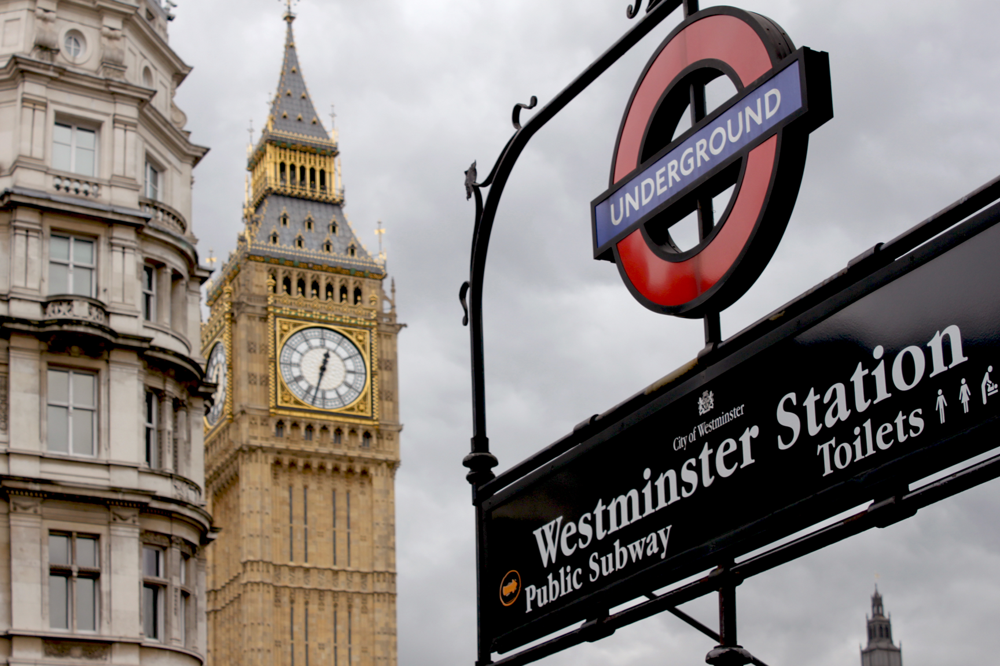
  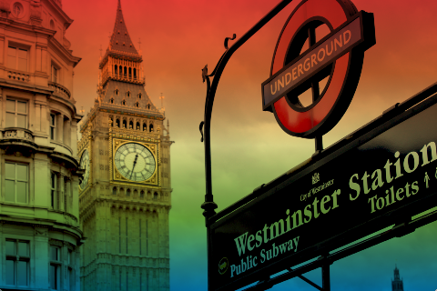
  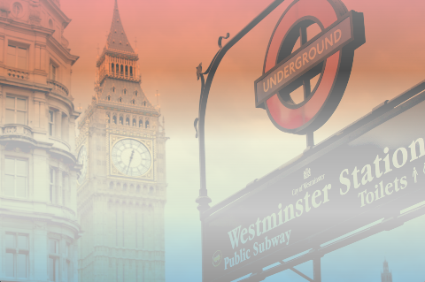
</p>

### Gradient backgrounds and shapes

These examples focus on pure gradient surfaces generated with mesh vertices and interpolated colors. They are useful for UI cards, menu backgrounds, decorative panels, abstract scenes, and quick visual prototyping inside Gideros.

<p align="center">
  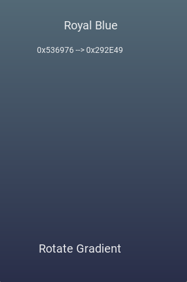
  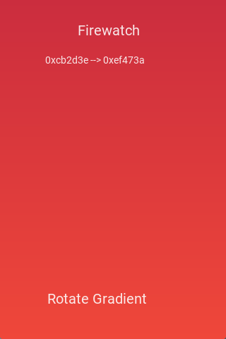
  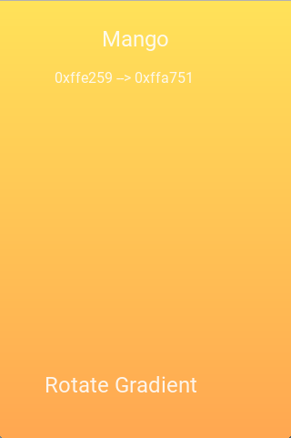
</p>

> These screenshots are generated examples. For a cleaner portfolio presentation, the visuals are intentionally kept simple: the image carries the gradient result, while names and descriptions live in the README instead of being embedded inside the screenshots.

---

## Visual examples

The examples below are grouped by rendering feature. Each screenshot is generated from a dedicated Gideros example script, so the visual documentation stays reproducible and easier to maintain.

### Gradient overlays

This example applies procedural gradient colors over a landscape texture. It is useful for hero images, game menus, splash screens, atmospheric backgrounds, and quick mood exploration.

<p align="center">
  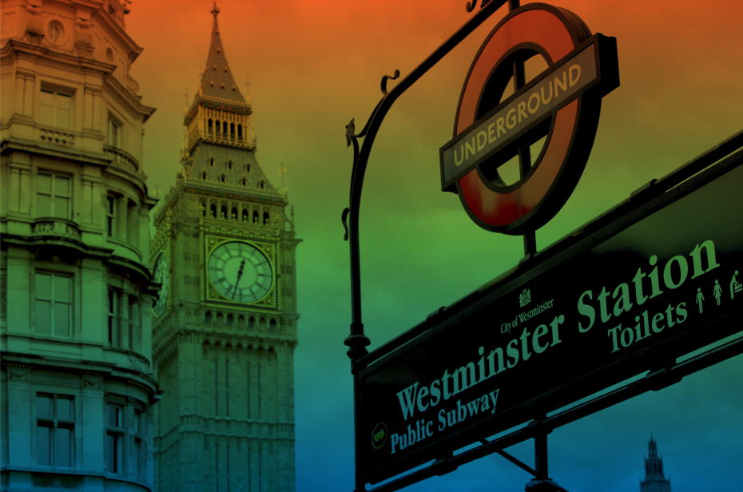
</p>

Generated from:

```lua
require "examples/gradient_overlay"
```

### Texture masking over rotated polygon meshes

Gideros Gradient Mesh can map an image texture onto polygon-based mesh geometry. This makes it possible to clip, rotate, tint, and antialias images using mesh vertices instead of pre-rendered bitmap masks.

<p align="center">
  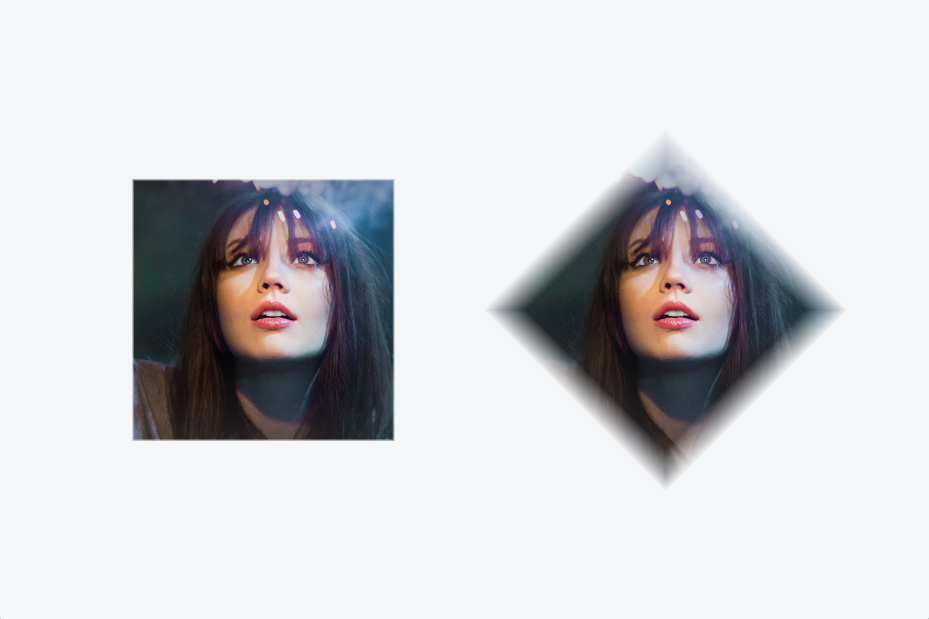
</p>

Generated from:

```lua
require "examples/texture_mask_rotated_mesh"
```

### Hexagon portrait texture masking

This example maps a portrait texture onto regular hexagon meshes. It shows how the same portrait can be clipped through polygon geometry while preserving the image and adding a subtle vertex-color tint.

<p align="center">
  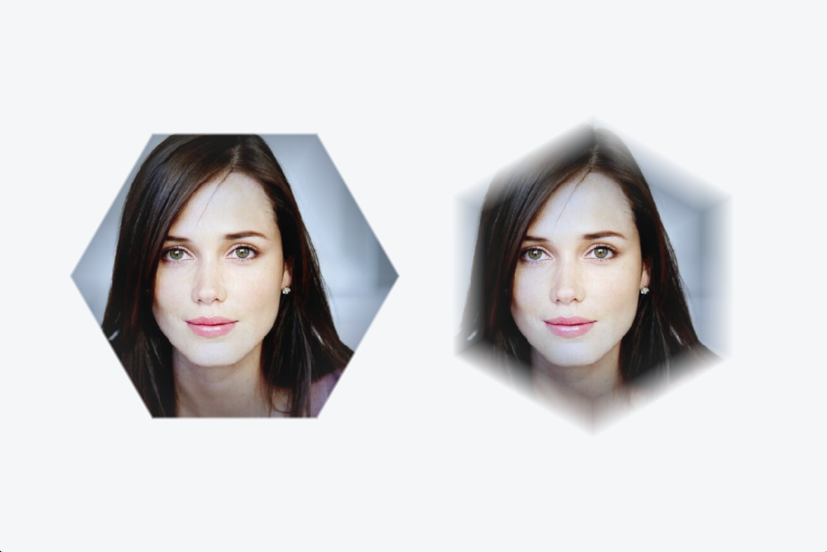
</p>

Generated from:

```lua
require "examples/hexagon_portrait_texture_mask"
```

### Radial shapes, holes, and deformation

Radial gradients are generated by creating rings of vertices around a center point. By changing the number of edges, scale factors, and inner radius, the same algorithm can produce circles, ellipses, polygons, donuts, and deformed radial shapes.

<p align="center">
  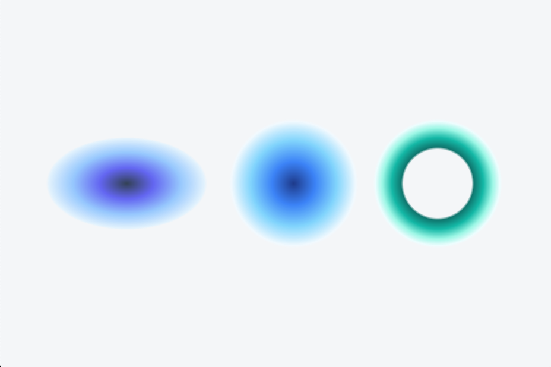
</p>

Generated from:

```lua
require "examples/radial_shapes_hole_deform"
```

### Splash texture masks

Splash examples combine texture masks with radial color interpolation. This is useful for expressive backgrounds, particle-like effects, menu accents, and creative coding experiments.

<p align="center">
  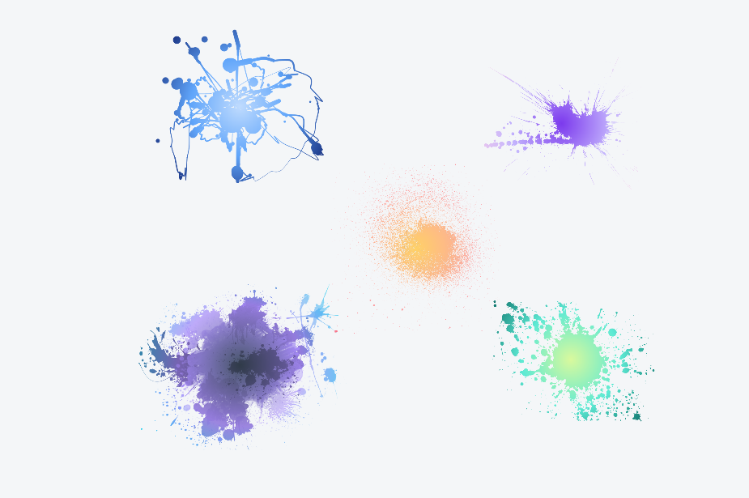
</p>

Generated from:

```lua
require "examples/radial_gradient_splash_masks"
```


---

## Example map

| Example | Focus | Output |
| --- | --- | --- |
| `gradient_overlay.lua` | Gradient overlay over texture | `docs/images/gradient-overlay-landscape.png` |
| `texture_mask_rotated_mesh.lua` | Square and rotated-square texture masking | `docs/images/texture-mask-rotated-mesh.png` |
| `hexagon_portrait_texture_mask.lua` | Portrait texture masking over hexagonal meshes | `docs/images/hexagon-portrait-texture-mask.png` |
| `radial_shapes_hole_deform.lua` | Radial shapes, holes, and deformation | `docs/images/radial-shapes-hole-deform.png` |
| `radial_gradient_splash_masks.lua` | Splash texture masks with radial gradients | `docs/images/radial-gradient-splash-masks.png` |

`main.lua` works as a simple sample launcher. Uncomment the sample you want to run:

```lua
--------------------------------------------------------------------------------
-- Gideros Gradient Mesh examples
--------------------------------------------------------------------------------

-- require "examples/gradient_overlay"
-- require "examples/texture_mask_rotated_mesh"
-- require "examples/hexagon_portrait_texture_mask"
-- require "examples/radial_shapes_hole_deform"
require "examples/radial_gradient_splash_masks"
```

---

## Why mesh-based gradients?

A usual 2D gradient can be treated as a color interpolation problem.
This library approaches the problem geometrically: it creates vertices, assigns a color to each vertex, and builds triangles between them.

For a rectangular gradient, the mesh is built as a grid:

```txt
v1 ----- v2 ----- v3
 | \      | \      |
 |  \     |  \     |
v4 ----- v5 ----- v6
 | \      | \      |
 |  \     |  \     |
v7 ----- v8 ----- v9
```

Each cell is split into two triangles:

```txt
(v1, v2, v5)
(v1, v5, v4)
```

Inside each triangle, the GPU interpolates the vertex colors, which creates the gradient.

Conceptually, for two colors `C0` and `C1`, a linear gradient can be described as:

```txt
C(t) = (1 - t)C0 + tC1
```

Where:

```txt
0 <= t <= 1
```

For multiple color stops, the same idea is applied piecewise between neighboring colors.

---

## Radial and polygon gradients

For circular and polygon-based gradients, the library creates rings of vertices around a center point.

A vertex on a ring can be described as:

```txt
x = cx + sx * r * p * cos(theta)
y = cy + sy * r * p * sin(theta)
```

Where:

* `cx`, `cy` are the center coordinates;
* `sx`, `sy` are scale factors;
* `r` is the base radius;
* `p` is the normalized radius percentage for the current color stop;
* `theta` is the vertex angle.

For a regular polygon with `n` edges, each angle advances around the shape:

```txt
theta_i = rotation + 2πi / n
```

The library then connects the center and the rings using triangle indices.
When antialiasing mode is enabled, it adds an extra outer ring with lower alpha to soften jagged edges.

---

## Features

* Rectangle gradients using mesh grids.
* Horizontal and vertical directions:

  * `tb`: top to bottom;
  * `bt`: bottom to top;
  * `lr`: left to right;
  * `rl`: right to left.
* Radial gradients for circles and regular polygons.
* Polygon deformation through scale factors.
* Optional inner hole for ring/donut-like shapes.
* Optional texture support.
* Optional antialiasing strategy through extra transparent mesh rings.
* Small, dependency-light Lua implementation.

---

## Installation

Copy `uiGradient.lua` into your Gideros project and require it from your scene or sample file:

```lua
local uiGradient = require "src/gradient_mesh"
```

---

## Quick start

```lua
local uiGradient = require "src/gradient_mesh"

local gradient = uiGradient.new()

gradient:rectangle({
    color = {
        0x0f2027,
        0x203a43,
        0x2c5364
    },
    alpha = {1, 1, 1},
    dimension = {320, 180},
    anchor = {0.5, 0.5},
    position = {160, 240},
    way = "lr"
})

stage:addChild(gradient)
```

---

## Radial example

```lua
local uiGradient = require "src/gradient_mesh"

local glow = uiGradient.new()

glow:circle({
    radius = 180,
    edges = 96,
    color = {
        0x833ab4,
        0xfd1d1d,
        0xfcb045
    },
    position = {240, 240},
    way = "co",
    jaggedFree = true
})

stage:addChild(glow)
```

---

## Regular polygon example

```lua
local uiGradient = require "src/gradient_mesh"

local polygon = uiGradient.new()

polygon:regularPolygon({
    edges = 6,
    radius = 160,
    color = {
        0x4776e6,
        0x8e54e9
    },
    position = {240, 240},
    scalePolygon = {1, 1},
    rotationMesh = 0,
    jaggedFree = true
})

stage:addChild(polygon)
```

---

## Configuration reference

| Option         | Description                                                     |
| -------------- | --------------------------------------------------------------- |
| `color`        | List of colors assigned to gradient stops.                      |
| `alpha`        | Optional alpha values per color stop.                           |
| `dimension`    | Width and height for rectangular gradients.                     |
| `radius`       | Radius for circles and regular polygons.                        |
| `edges`        | Number of polygon edges. Higher values create smoother circles. |
| `position`     | Mesh position on stage.                                         |
| `anchor`       | Anchor point for rectangular gradients.                         |
| `way`          | Gradient direction: `tb`, `bt`, `lr`, `rl`, `co`, `oc`.         |
| `hole`         | Enables an inner hole for radial shapes.                        |
| `rIn`          | Inner radius when `hole` is enabled.                            |
| `scalePolygon` | Deforms polygon/circle proportions.                             |
| `rotation`     | Rotates the full mesh object.                                   |
| `rotationMesh` | Rotates only the mesh vertices.                                 |
| `texture`      | Optional texture configuration.                                 |
| `jaggedFree`   | Adds a soft transparent ring to reduce jagged edges.            |
| `colorOn`      | Enables or disables mesh color assignment.                      |

---

## Project structure

```txt
Gradient/
├── docs/images/          # Rendered examples and visual outputs
├── Samples/          # Gideros sample scenes
├── Sources/          # Images, fonts, and source assets
├── main.lua          # Sample selector
├── uiGradient.lua    # Core gradient mesh utility
├── Gradient.gproj    # Gideros project file
├── LICENSE
└── README.md
```

---

## Suggested visual cleanup

To make the repository feel more modern and portfolio-ready:

1. Keep generated images clean, without text overlays.
2. Use descriptive file names.
3. Present gradient names in the README, not inside the image.
4. Prefer polished abstract visuals over model/face examples unless the source images are licensed, high quality, and visually consistent.
5. Add one hero image at the top once the visual identity is stable.

Recommended result names:

```txt
gradient-mesh-regular-polygons.png
gradient-mesh-cosmic-fusion.png
gradient-mesh-firewatch.png
gradient-mesh-mango.png
gradient-mesh-royal-blue.png
gradient-mesh-big-rainbow.png
gradient-mesh-big-fog.png
```

---

## Built with

* [Lua](https://www.lua.org/)
* [Gideros](https://github.com/gideros/gideros)

---

## Inspiration

This project was inspired by gradient palette collections such as [uiGradients](https://uigradients.com/), but implemented as procedural mesh rendering for Gideros.

---

## Authors

* **Hubert Ronald** - *Initial work* - [HubertRonald](https://github.com/HubertRonald)

See also the list of [contributors](https://github.com/HubertRonald/Gradient/contributors) who participated in this project.

---

## License

This project is licensed under the MIT License - see the [LICENSE](LICENSE) file for details
